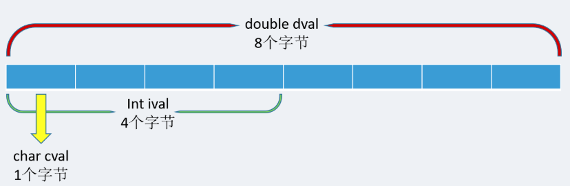

# 大小端模式判断的代码实现(另类)


> * 大端模式：大端模式，是指数据的高字节保存在内存的低地址中，而数据的低字节保存在内存的高地址中。
> * 小端模式：小端模式，是指数据的高字节保存在内存的高地址中，而数据的低字节保存在内存的低地址中。


* 区分方法
下面以unsigned int value = 0x12345678为例，分别看看在两种字节序下其存储情况:

|内存地址|小端模式存放内容|大端模式存放内容|
|---|---|---|
|0x4000|0x78|0x12|
|0x4001|0x56|0x34|
|0x4002|0x34|0x56|
|0x4003|0x12|0x78|

* 代码实现区分
```c
/* 小端返回1 大端返回0 */
int checkSystem()
{
   union check
   {
        char cval;
        int ival;
        double dval;
   } c;
   c.ival = 1;
   return (c.cval ==1);
}
```

* 代码解析

首先解析下联合体的字节对齐方式：
```c
union Token{
   char cval;
   int ival;
   double dval;
};
```
在内存中就如下图所示：


因此，`c.i = 1` 首先确定变量 c 在内存中占4个字节长度，`c.ch` 指的是 4 个字节中的低内存地址，数字 1 被赋值与 int 型变量，为 0x00000001,1在最低位上，如果数据的低位在内存的低字节（即 c.ch=1），表示系统为小端模式，如果数据的低位在内存的高字节（即 c.ch=0），表示系统为大端模式。