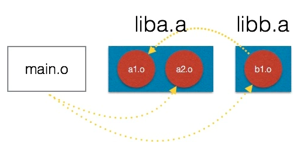

# <font color=red>库文件的编译及链接</font>

> 库是写好的现有的，成熟的，可以复用的代码。现实中每个程序都要依赖很多基础的底层库，不可能每个人的代码都从零开始，因此库的存在意义非同寻常。本质上来说库是一种可执行代码的二进制形式，可以被操作系统载入内存执行。库有两种：静态库（.a）和动态库（.so）。

[TOC]

## <font color=red>静态库</font>

* <font color=red>简介</font>
    * 之所以成为【静态库】，是因为在链接阶段，会将汇编生成的目标文件 .o 与引用到的库一起链接打包到可执行文件中。因此对应的链接方式称为静态链接。
    * 试想一下，静态库与汇编生成的目标文件一起链接为可执行文件，那么静态库必定跟.o文件格式相似。其实一个静态库可以简单看成是一组目标文件（.o/.obj文件）的集合，即很多目标文件经过压缩打包后形成的一个文件。

* <font color=red>特点</font>
    * 静态库对函数库的链接是放在编译时期完成的。
    * 程序在运行时与函数库再无瓜葛，因为可执行程序已经包含库函数内的信息，移植方便。
    * 浪费空间和资源，因为所有相关的目标文件与牵涉到的函数库被链接合成一个可执行文件。

* <font color=red>命名规则</font>
Linux静态库命名规范，必须是 “lib[your_library_name].a”：lib为前缀，中间是静态库名，扩展名为.a。
例如，创建一个名为 test 的静态库，其命名为 libtest.a。

* <font color=red>静态库的创建</font>
    Linux下使用 **ar** 指令进行静态库操作。
    假如有 a.c b.c c.c 三个源文件，如要将其封装成一个静态库文件 libtest.a 具体创建步骤如下：
    * 首先，将源文件编译成目标文件.o （a.o b.o c.o）
    `gcc -c a.c b.c c.c`

    *  通过 ar 指令将目标文件打包成 .a 静态库文件
    `ar -crv libtest.a a.o b.o c.o`

* <font color=red>静态库的使用</font>
    Linux下使用静态库，只需要在编译的时候，指定静态库的搜索路径（-L选项）、指定静态库名（不需要lib前缀和.a后缀，-l选项）。

    举例：源文件 main.c，需要链接 libtest.a 静态库，生成可执行程序 main，静态库在 ./lib 目录下，其头文件在 ./include 路径下：
    `gcc -o main main.c -L./lib -ltest -I./include`

* <font color=red>多个静态库合成一个静态库</font>
    有时一个程序需要链接多个静态库文件，比较混乱，需要将多个静态库文件合成一个静态库文件。
    举例：现有 liba.a libb.a libc.a 三个静态库文件，需要将其合成为 libone.a：
    * 使用 ar 指令的 "x" 选项，将原有静态库文件拆解为目标文件(.o)。
        ```c
        ar x liba.a
        ar x libb.a
        ar x libc.a
        ```
    * 通过 ar 指令将目标文件打包成 .a 静态库文件
    `ar -crv libone.a *.o`

## <font color=red>动态库</font>

* <font color=red>由来</font>
    为什么需要动态库，其实也是静态库的特点导致：
    * 空间浪费是静态库的一个问题；
    * 另一个问题是静态库对程序的更新、部署和发布页会带来麻烦。如果静态库更新了，使用它的应用程序都需要重新编译、发布给用户（对于玩家来说，可能是一个很小的改动，却导致整个程序重新下载，全量更新）。

* <font color=red>特点</font>
    * 动态库把对一些库函数的链接载入推迟到程序运行的时期。
    * 可以实现进程之间的资源共享。（因此动态库也称为共享库）
    * 将一些程序升级变得简单。
    * 甚至可以真正做到链接载入完全由程序员在程序代码中控制（显示调用）。

* <font color=red>动态库与静态库区别</font>
动态库在程序编译时并不会被连接到目标代码中，而是在程序运行是才被载入。不同的应用程序如果调用相同的库，那么在内存里只需要有一份该共享库的实例，规避了空间浪费问题。动态库在程序运行是才被载入，也解决了静态库对程序的更新、部署和发布页会带来麻烦。用户只需要更新动态库即可，增量更新。

* <font color=red>动态库命名规则</font>
动态链接库的名字形式为 libxxx.so，前缀是lib，后缀名为 ".so"
例如：取名动态库名为 test，则按照动态库取名规则，必须为 libtest.so。

* <font color=red>动态库的创建</font>
    与创建静态库不同的是，不需要 ar 指令，直接使用编译器即可创建动态库。
    假如有 a.c b.c c.c 三个源文件，如要将其封装成一个动态库文件 libtest.so 具体创建步骤如下：
    * 首先，生成目标文件，此时要加编译器选项-fPIC
    `gcc -fPIC -c a.c b.c c.c`
    -fPIC 创建与地址无关的编译程序（pic，position independent code），是为了能够在多个应用程序间共享。

    * 然后，生成动态库，此时要加链接器选项-shared，-shared指定生成动态链接库。
    `gcc -shared -o libtest.so a,o b.o c.o`

    * 上面两个步骤可以合成单个步骤：
    `g++ -fPIC -shared -o libtest.so a.c b.c c.c`

* <font color=red>动态库的使用</font>
    动态库的使用和静态库稍有不同，不同点在于<font color=red>编译器链接动态库前需要使系统知晓此动态库的位置</font>，只要动态库放在 /lib 或者 /usr/lib 路径下，系统就可找到此动态库。
    举例：源文件 main.c，需要链接 libtest.so 静态库，生成可执行程序 main，动态库在 ./lib 目录下，其头文件在 ./include 路径下，具体步骤如下：
    * 将动态库复制在/lib 或者 /usr/lib 路径下
    `cp libtest.so /lib`
    * 链接动态库（这一步骤与静态库相同）
    只需要在编译的时候，指定静态库的搜索路径（-L选项），不指定搜索路径也可以，因为第一步已经将其复制在 /lib 中了，指定静态库名（不需要lib前缀和.so后缀，-l选项）。
    `gcc -o main main.c -L./lib -ltest -I./include` 或
    `gcc -o main main.c -ltest -I./include`


## <font color=red>静态库的链接顺序</font>

* **引入**：C语言的静态连接，简单的说就是将编译得到的目标文件.o(.obj)，打包在一起，并修改目标文件中函数调用地址偏移量的过程。当在大一点的项目中，可能会遇到连接时，由于静态库在链接器命令行中出现顺序的问题，造成undefined reference错误。本文深入探讨一下这个问题，以及如何解决。   

* **问题**：如下图。假设有这么一个场景，在我们的构建系统中，构建了一个两个静态库文件 liba.a 和 libb.a，其中 liba.a 包含两个目标文件 a1.o 和 a2.o，而 libb.a 包含一个目标文件 b1.o。希望将 main.o 静态连接 liba.a 和 libb.a。
    
    <font color=red>注意</font>：黄色的箭头表示调用关系：b1.o 需要调用 a1.o 中的某函数，而 main.o 调用了a2.o 和 b1.o 中的函数。你可以把 .o 文件理解为对应的 .c 文件。

    那么如下的两个命令哪个会成功执行呢？注意到这两个命令唯一的区别是对liba.a和libb.a的书写顺序：
    ```c
    # gcc -o a.out main.o liba.a libb.a
 
    ...undefined reference...
    error: ld returned 1 exit status
    ```
    按照上述方法编译会出错，下述方法可以编译成功：
    `# gcc -o a.out main.o libb.a liba.a`

* **静态链接的算法**
    要理解上面这个问题，需要理解链接器在处理静态连接时候的算法。此处的阐述参考《深入理解计算机系统》中的“链接”章节。具体链接步骤如下：

    * 首先，需要明确的是，链接器在考察库文件(.a)的时候，不是把库文件看做一个整体</font>，而是将打包在其中的目标文件(.o)作为考察单元。<font color=red>在整个连接过程中，如果某个目标文件中的符号被用到了，那么这个目标文件会单独从库文件中提取出来，而不会把整个库文件连接进来</font>。
    * 然后，链接器在工作过程中，维护 3 个集合：需要参与连接的目标文件集合 E、一个未解析符号集合 U、一个在 E 中所有目标文件定义过的所有符号集合 D。
    * 以上面第一条命令 `gcc -o a.out main.o liba.a libb.a` 为例，我们来一步步看看链接器的工作过程。
        * 1.当输入 main.o 后，由于 main 调用了 a2.o 和 b1.o 中的函数，而此时并没有在 D 中找到该符号，于是将引用的两个函数保存在 U 中，此处假设两个函数分别为 a2_func() 和 b1_func() ：
            |E|U|D|
            |:---:|:---:|:---:|
            | main.o |a2_func()<br>b1_func()||

        * 2.接下来，输入 liba.a，链接器发现，a2_func() 存在于 liba.a 的 a2.o 中，于是将 a2.o 加入到 E，并在 D 中加入 a2.o 中所有定义的符号，其中包括 a2_func()，最后移除 U 中的 a2_func()，因为这个符号已经在 a2.o 中找到了的。然而，U 中还有 b1_func()，所以链接还没有完成。
            |E|U|D|
            |:---:|:---:|:---:|
            | main.o |b1_func()||
            |a2.o||a2_func()<br>a2_func_other()|

        * 3.接着，输入 libb.a，同理，链接器发现 b1_func() 定义在 b1.o中，所以在 E 中加入 b1.o，移除 U 中的 b1_func()，在 D 中加入 b1.o 里面所有定义的符号。
            |E|U|D|
            |:---:|:---:|:---:|
            | main.o |||
            |a2.o||a2_func()<br>a2_func_other()|
            |b1.o||b1_func()<br>b1_func_other()|

        * 4.然而，由于 b1.o 调用到 a1.o 中的函数，我们假设是 a1_func，但在 D 中并没有找到这个函数，所以 a1_func 还需要加入到 U 中。
            |E|U|D|
            |:---:|:---:|:---:|
            | main.o |||
            |a2.o||a2_func()<br>a2_func_other()|
            |b1.o|a1_func()|b1_func()<br>b1_func_other()|

        * 5.但是，输入结束了！链接器发现 U 中还有未解析的符号，所以报错了！

* <font color=red>解决方法</font>

    * 方法1 ：一种是仔细分析依赖关系，并按照正确的顺序书写库文件的引用。原则是被依赖的尽量写在右边。
        还是以上述例子为例，如果先链接 libb.a，再链接 liba.a，看看情况如何：
        * 1.当输入 main.o 后，由于 main 调用了 a2.o 和 b1.o 中的函数，而此时并没有在 D 中找到该符号，于是将引用的两个函数保存在 U 中，此处假设两个函数分别为 a2_func() 和 b1_func() ：
            |E|U|D|
            |:---:|:---:|:---:|
            | main.o |a2_func()<br>b1_func()||

        * 2.接下来，输入 libb.a，链接器发现，b1_func() 存在于 libb.a 的 b1.o 中，于是将 b1.o 加入到 E，并在 D 中加入 b1.o 中所有定义的符号，其中包括 b1_func()，最后移除 U 中的 b1_func()，因为这个符号已经在 b1.o 中找到了的。然而，U 中还有 a2_func()，所以链接还没有完成。
            |E|U|D|
            |:---:|:---:|:---:|
            | main.o |a2_func()||
            |b1.o||b1_func()<br>b1_func_other()|
        
        * 3.接着，b1_func() 中引用 a1_func()，但是在 D 中没有找到a1_func()，因此需要将 a1_func() 加入到U中。
            |E|U|D|
            |:---:|:---:|:---:|
            | main.o |a2_func()||
            |b1.o|a1_func()|b1_func()<br>b1_func_other()|

        * 4.接着接着，输入 liba.a，同理，链接器发现 a1_func() 定义在 a1.o 中，a2_func() 定义在 a2.o 中，所以在 E 中加入 a1.o 和 a2.o，移除 U 中的 a1_func() 和 a2_func()，在 D 中加入 a1.o 和 a2.o 里面所有定义的符号。
            |E|U|D|
            |:---:|:---:|:---:|
            | main.o |||
            |b1.o||b1_func()<br>b1_func_other()|
            |a1.o||a1_func()<br>a1_func_other()|
            |a2.o||a2_func()<br>a2_func_other()|
        
        * 5.输入结束，链接器发现 U 中没有未解析的符号，链接成功。

    * 方法2：但是在有些大型项目中，依赖关系可能并不容易梳理清楚。此时可以在命令行参数中重复对库文件的引用。例如：
        `gcc -o a.out main.o liba.la libb.la liba.a`
